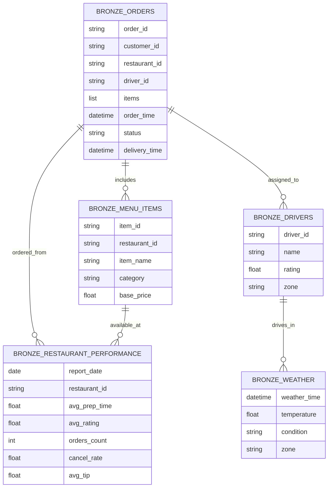

```mermaid
erDiagram
    BRONZE_ORDERS ||--o{ BRONZE_MENU_ITEMS : includes
    BRONZE_ORDERS ||--o{ BRONZE_DRIVERS : assigned_to
    BRONZE_ORDERS ||--o{ BRONZE_RESTAURANT_PERFORMANCE : ordered_from
    BRONZE_DRIVERS ||--o{ BRONZE_WEATHER : drives_in
    BRONZE_MENU_ITEMS ||--o{ BRONZE_RESTAURANT_PERFORMANCE : available_at

    BRONZE_ORDERS {
        string order_id
        string customer_id
        string restaurant_id
        string driver_id
        list items
        datetime order_time
        string status
        datetime delivery_time
    }

    BRONZE_MENU_ITEMS {
        string item_id
        string restaurant_id
        string item_name
        string category
        float base_price
    }

    BRONZE_DRIVERS {
        string driver_id
        string name
        float rating
        string zone
    }

    BRONZE_RESTAURANT_PERFORMANCE {
        date report_date
        string restaurant_id
        float avg_prep_time
        float avg_rating
        int orders_count
        float cancel_rate
        float avg_tip
    }

    BRONZE_WEATHER {
        datetime weather_time
        float temperature
        string condition
        string zone
    }


```