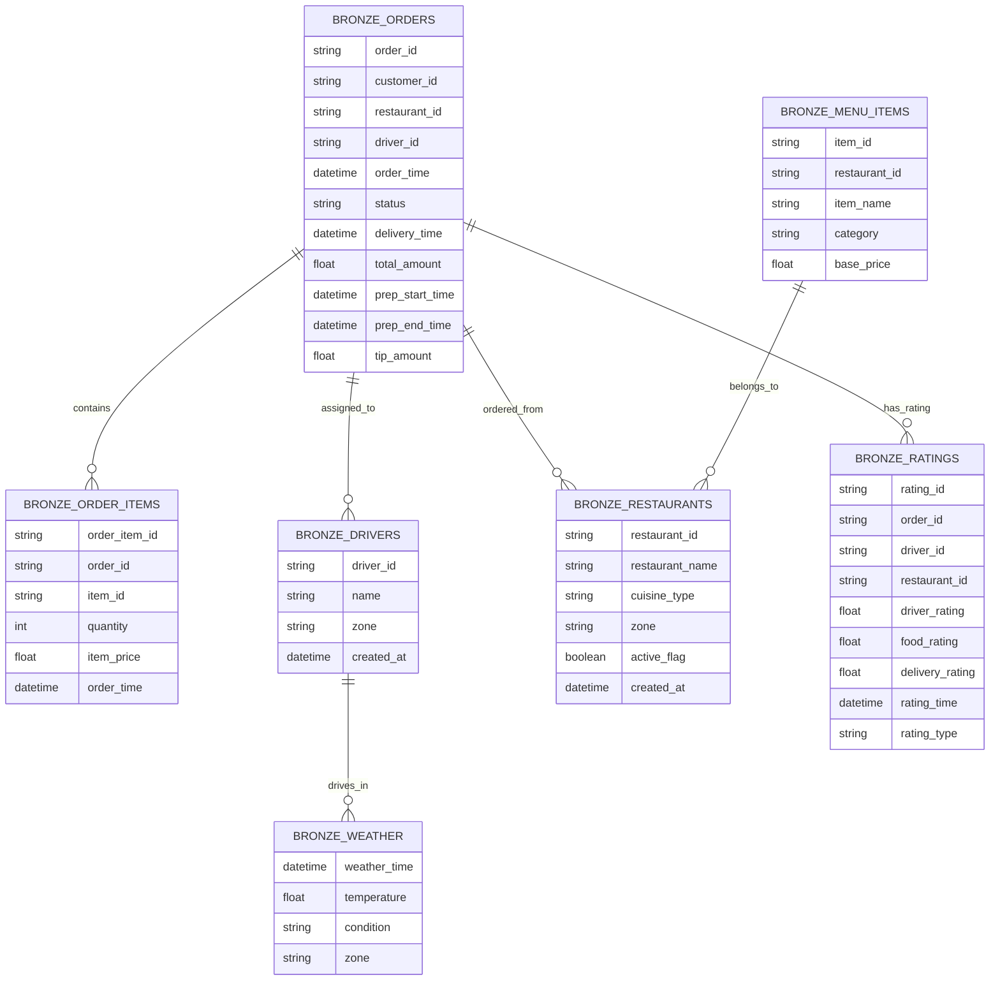

```mermaid
erDiagram
    BRONZE_ORDERS ||--o{ BRONZE_ORDER_ITEMS : contains
    BRONZE_ORDERS ||--o{ BRONZE_DRIVERS : assigned_to
    BRONZE_ORDERS ||--o{ BRONZE_RESTAURANTS : ordered_from
    BRONZE_ORDERS ||--o{ BRONZE_RATINGS : has_rating
    BRONZE_DRIVERS ||--o{ BRONZE_WEATHER : drives_in
    BRONZE_MENU_ITEMS ||--o{ BRONZE_RESTAURANTS : belongs_to

    BRONZE_ORDERS {
        string order_id
        string customer_id
        string restaurant_id
        string driver_id
        datetime order_time
        string status
        datetime delivery_time
        float total_amount
        datetime prep_start_time
        datetime prep_end_time
        float tip_amount
    }

    BRONZE_ORDER_ITEMS {
        string order_item_id
        string order_id
        string item_id
        int quantity
        float item_price
        datetime order_time
    }

    BRONZE_MENU_ITEMS {
        string item_id
        string restaurant_id
        string item_name
        string category
        float base_price
    }

    BRONZE_DRIVERS {
        string driver_id
        string name
        string zone
        datetime created_at
    }

    BRONZE_RESTAURANTS {
        string restaurant_id
        string restaurant_name
        string cuisine_type
        string zone
        boolean active_flag
        datetime created_at
    }

    BRONZE_RATINGS {
        string rating_id
        string order_id
        string driver_id
        string restaurant_id
        float driver_rating
        float food_rating
        float delivery_rating
        datetime rating_time
        string rating_type
    }

    BRONZE_WEATHER {
        datetime weather_time
        float temperature
        string condition
        string zone
    }


```