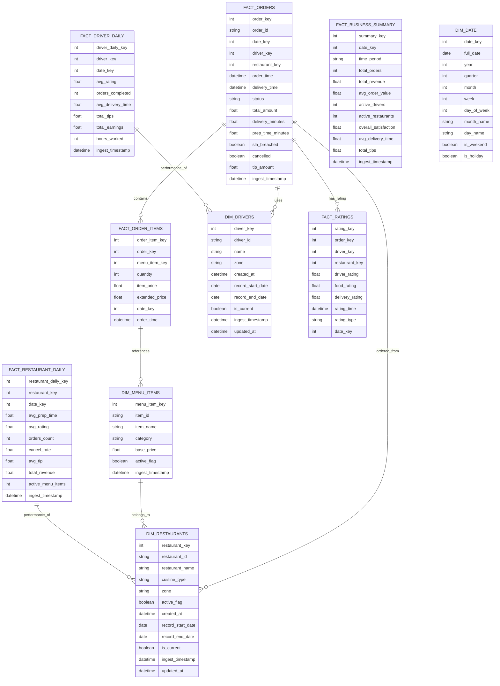

```mermaid
erDiagram
    FACT_ORDERS ||--o{ FACT_ORDER_ITEMS : contains
    FACT_ORDERS ||--o{ DIM_DRIVERS : uses
    FACT_ORDERS ||--o{ DIM_RESTAURANTS : ordered_from
    FACT_ORDER_ITEMS ||--o{ DIM_MENU_ITEMS : references
    DIM_MENU_ITEMS ||--o{ DIM_RESTAURANTS : belongs_to
    FACT_ORDERS ||--o{ FACT_RATINGS : has_rating
    FACT_RESTAURANT_DAILY ||--o{ DIM_RESTAURANTS : performance_of
    FACT_DRIVER_DAILY ||--o{ DIM_DRIVERS : performance_of

    FACT_ORDERS {
        int order_key
        string order_id
        int date_key
        int driver_key
        int restaurant_key
        datetime order_time
        datetime delivery_time
        string status
        float total_amount
        float delivery_minutes
        float prep_time_minutes
        boolean sla_breached
        boolean cancelled
        float tip_amount
        datetime ingest_timestamp
    }

    FACT_ORDER_ITEMS {
        int order_item_key
        int order_key
        int menu_item_key
        int quantity
        float item_price
        float extended_price
        int date_key
        datetime order_time
    }

    FACT_RATINGS {
        int rating_key
        int order_key
        int driver_key
        int restaurant_key
        float driver_rating
        float food_rating
        float delivery_rating
        datetime rating_time
        string rating_type
        int date_key
    }

    FACT_RESTAURANT_DAILY {
        int restaurant_daily_key
        int restaurant_key
        int date_key
        float avg_prep_time
        float avg_rating
        int orders_count
        float cancel_rate
        float avg_tip
        float total_revenue
        int active_menu_items
        datetime ingest_timestamp
    }

    FACT_DRIVER_DAILY {
        int driver_daily_key
        int driver_key
        int date_key
        float avg_rating
        int orders_completed
        float avg_delivery_time
        float total_tips
        float total_earnings
        int hours_worked
        datetime ingest_timestamp
    }

    FACT_BUSINESS_SUMMARY {
        int summary_key
        int date_key
        string time_period
        int total_orders
        float total_revenue
        float avg_order_value
        int active_drivers
        int active_restaurants
        float overall_satisfaction
        float avg_delivery_time
        float total_tips
        datetime ingest_timestamp
    }

    DIM_DRIVERS {
        int driver_key
        string driver_id
        string name
        string zone
        datetime created_at
        date record_start_date
        date record_end_date
        boolean is_current
        datetime ingest_timestamp
        datetime updated_at
    }

    DIM_RESTAURANTS {
        int restaurant_key
        string restaurant_id
        string restaurant_name
        string cuisine_type
        string zone
        boolean active_flag
        datetime created_at
        date record_start_date
        date record_end_date
        boolean is_current
        datetime ingest_timestamp
        datetime updated_at
    }

    DIM_MENU_ITEMS {
        int menu_item_key
        string item_id
        string item_name
        string category
        float base_price
        boolean active_flag
        datetime ingest_timestamp
    }

    DIM_DATE {
        int date_key
        date full_date
        int year
        int quarter
        int month
        int week
        int day_of_week
        string month_name
        string day_name
        boolean is_weekend
        boolean is_holiday
    }


```