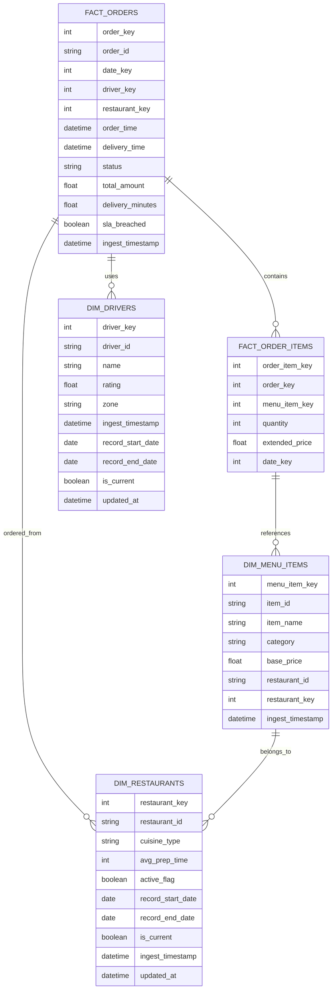

```mermaid
erDiagram
    FACT_ORDERS ||--o{ FACT_ORDER_ITEMS : contains
    FACT_ORDERS ||--o{ DIM_DRIVERS : uses
    FACT_ORDERS ||--o{ DIM_RESTAURANTS : ordered_from
    FACT_ORDER_ITEMS ||--o{ DIM_MENU_ITEMS : references
    DIM_MENU_ITEMS ||--o{ DIM_RESTAURANTS : belongs_to

    FACT_ORDERS {
        int order_key
        string order_id
        int date_key
        int driver_key
        int restaurant_key
        datetime order_time
        datetime delivery_time
        string status
        float total_amount
        float delivery_minutes
        boolean sla_breached
        datetime ingest_timestamp
    }

    FACT_ORDER_ITEMS {
        int order_item_key
        int order_key
        int menu_item_key
        int quantity
        float extended_price
        int date_key
    }

    DIM_DRIVERS {
        int driver_key
        string driver_id
        string name
        float rating
        string zone
        datetime ingest_timestamp
        date record_start_date
        date record_end_date
        boolean is_current
        datetime updated_at
    }

    DIM_RESTAURANTS {
        int restaurant_key
        string restaurant_id
        string cuisine_type
        int avg_prep_time
        boolean active_flag
        date record_start_date
        date record_end_date
        boolean is_current
        datetime ingest_timestamp
        datetime updated_at
    }

    DIM_MENU_ITEMS {
        int menu_item_key
        string item_id
        string item_name
        string category
        float base_price
        string restaurant_id
        int restaurant_key
        datetime ingest_timestamp
    }


```