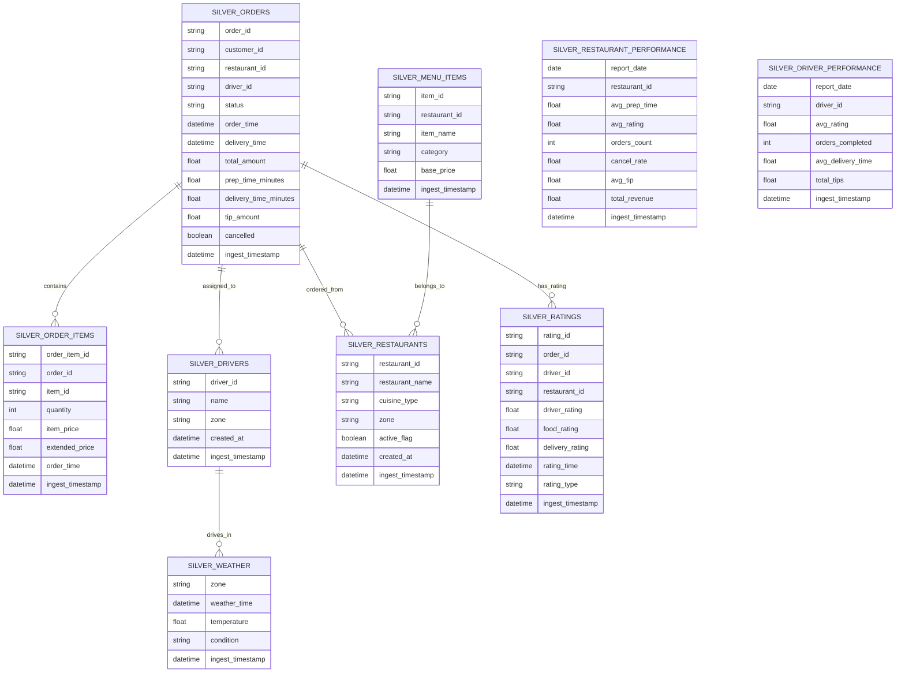

```mermaid
erDiagram
    SILVER_ORDERS ||--o{ SILVER_ORDER_ITEMS : contains
    SILVER_ORDERS ||--o{ SILVER_DRIVERS : assigned_to
    SILVER_ORDERS ||--o{ SILVER_RESTAURANTS : ordered_from
    SILVER_ORDERS ||--o{ SILVER_RATINGS : has_rating
    SILVER_DRIVERS ||--o{ SILVER_WEATHER : drives_in
    SILVER_MENU_ITEMS ||--o{ SILVER_RESTAURANTS : belongs_to

    SILVER_ORDERS {
        string order_id
        string customer_id
        string restaurant_id
        string driver_id
        string status
        datetime order_time
        datetime delivery_time
        float total_amount
        float prep_time_minutes
        float delivery_time_minutes
        float tip_amount
        boolean cancelled
        datetime ingest_timestamp
    }

    SILVER_ORDER_ITEMS {
        string order_item_id
        string order_id
        string item_id
        int quantity
        float item_price
        float extended_price
        datetime order_time
        datetime ingest_timestamp
    }

    SILVER_MENU_ITEMS {
        string item_id
        string restaurant_id
        string item_name
        string category
        float base_price
        datetime ingest_timestamp
    }

    SILVER_DRIVERS {
        string driver_id
        string name
        string zone
        datetime created_at
        datetime ingest_timestamp
    }

    SILVER_RESTAURANTS {
        string restaurant_id
        string restaurant_name
        string cuisine_type
        string zone
        boolean active_flag
        datetime created_at
        datetime ingest_timestamp
    }

    SILVER_RATINGS {
        string rating_id
        string order_id
        string driver_id
        string restaurant_id
        float driver_rating
        float food_rating
        float delivery_rating
        datetime rating_time
        string rating_type
        datetime ingest_timestamp
    }

    SILVER_RESTAURANT_PERFORMANCE {
        date report_date
        string restaurant_id
        float avg_prep_time
        float avg_rating
        int orders_count
        float cancel_rate
        float avg_tip
        float total_revenue
        datetime ingest_timestamp
    }

    SILVER_DRIVER_PERFORMANCE {
        date report_date
        string driver_id
        float avg_rating
        int orders_completed
        float avg_delivery_time
        float total_tips
        datetime ingest_timestamp
    }

    SILVER_WEATHER {
        string zone
        datetime weather_time
        float temperature
        string condition
        datetime ingest_timestamp
    }


```