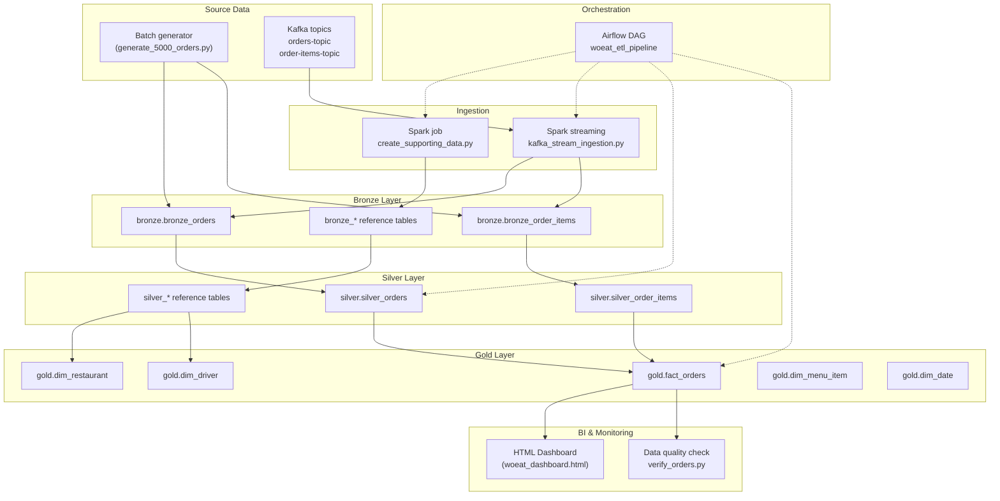

# WoEat Data Platform – Architecture Overview

The following Mermaid diagram illustrates the complete flow of data—from event generation through ingestion, processing layers, orchestration, and finally analytics & monitoring.

*Airflow orchestrates every stage (dotted arrows).* Facts and dimensions in the Gold layer feed the dashboard and verification scripts that monitor data quality and key business metrics. 