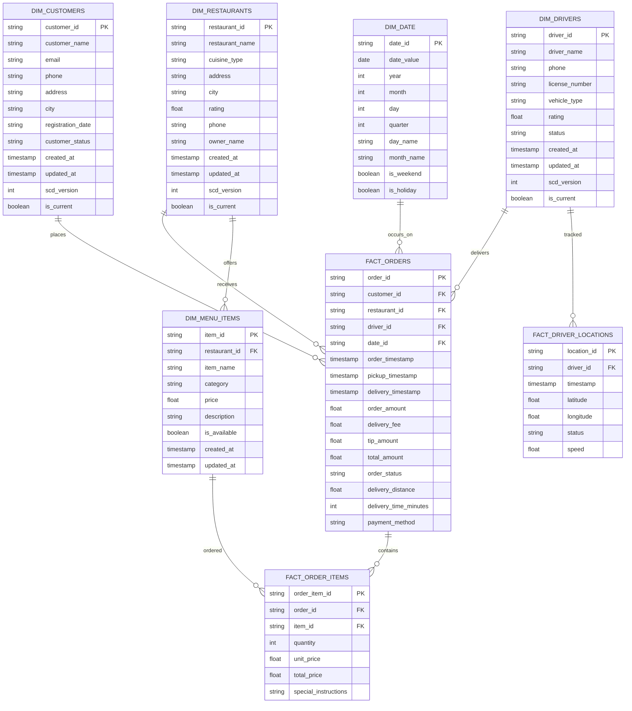
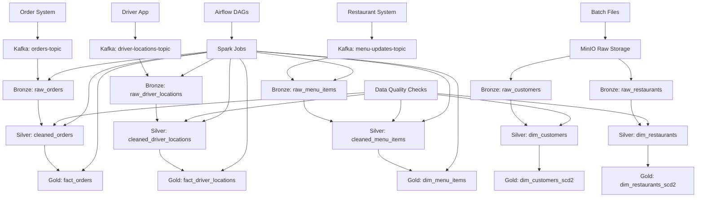

# WoEat Data Model

## Overview
The WoEat platform data model follows a star schema design with fact and dimension tables organized across bronze, silver, and gold layers.

## Bronze Layer (Raw Data)
Raw data ingested from various sources without transformation.

## Silver Layer (Cleaned Data)
Cleaned and validated data with proper data types and quality checks.

## Gold Layer (Business Ready)
Aggregated and business-ready data for analytics and reporting.

## Entity Relationship Diagram

## Data Pipeline Architecture

## Slowly Changing Dimensions (SCD Type 2)

The following dimensions implement SCD Type 2 to track historical changes:
- **dim_customers**: Track customer profile changes
- **dim_restaurants**: Track restaurant information changes
- **dim_drivers**: Track driver status and rating changes

### SCD Type 2 Fields
- `scd_version`: Version number for each record
- `is_current`: Boolean flag indicating current record
- `created_at`: When the record was created
- `updated_at`: When the record was last updated 