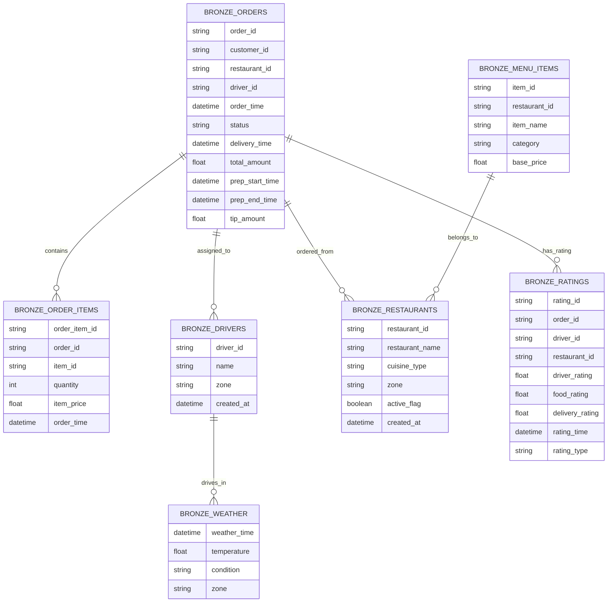
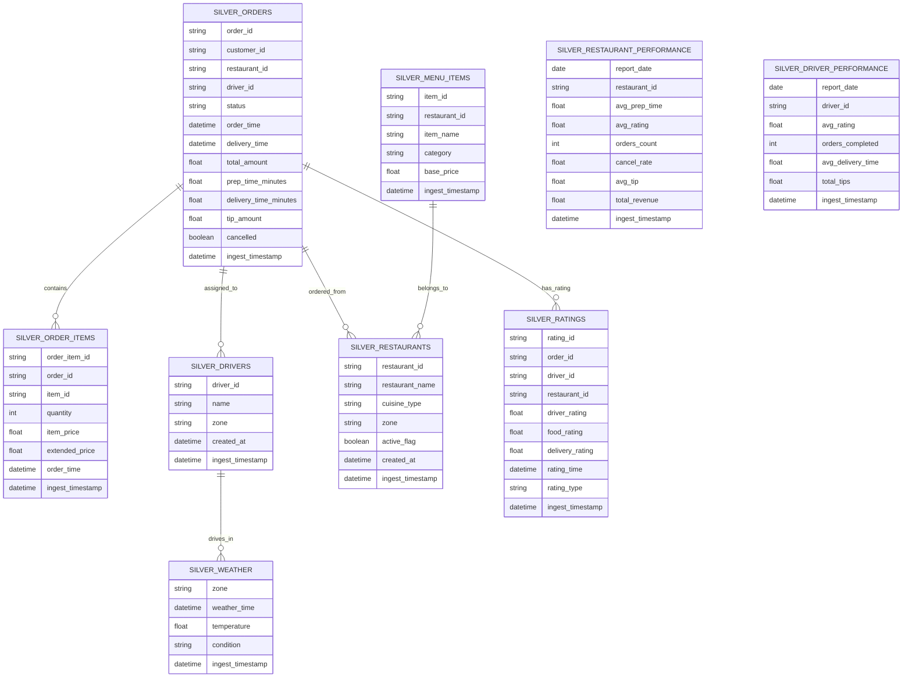
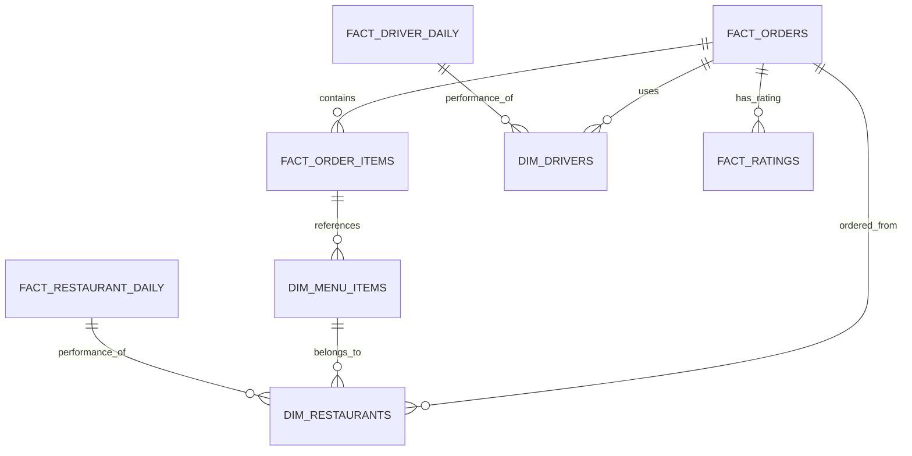

# WoEat Data Model Documentation

The WoEat data model implements a modern medallion architecture (Bronze → Silver → Gold) using Apache Iceberg tables, designed to support a food delivery platform's analytics and operational needs.

---

## 1. Bronze Layer – Raw Ingested Data

---

## 2. Silver Layer – Cleansed & Conformed Data

---

## 3. Gold Layer – Star Schema for Analytics

---

## 4. Dimension Tables

| Table | Purpose | Grain | Key | Notable Attributes |
|-------|---------|-------|-----|--------------------|
| `dim_date` | Calendar reference for all facts | One row per calendar day | `date_key` | `is_weekend`, `is_holiday` |
| `dim_drivers` | Slowly changing record of delivery drivers | Driver × validity period (SCD-2) | `driver_key` | `zone`, `is_current`, `record_start_date`, `record_end_date` |
| `dim_restaurants` | Slowly changing record of restaurants | Restaurant × validity period (SCD-2) | `restaurant_key` | `cuisine_type`, `zone`, `active_flag` |
| `dim_menu_items` | Static menu catalog | Menu item | `menu_item_key` | `category`, `base_price`, `active_flag` |

---

## 5. Fact Tables

| Table | Grain | Foreign Keys | Measures |
|-------|-------|--------------|----------|
| `fact_orders` | One order | `date_key`, `driver_key`, `restaurant_key` | `total_amount`, `delivery_minutes`, `sla_breached`, `tip_amount` |
| `fact_order_items` | Order line | `order_key`, `menu_item_key`, `date_key` | `quantity`, `item_price`, `extended_price` |
| `fact_ratings` | One rating event | `order_key`, `driver_key`, `restaurant_key`, `date_key` | `driver_rating`, `food_rating`, `delivery_rating` |
| `fact_restaurant_daily` | Restaurant × day | `restaurant_key`, `date_key` | `avg_prep_time`, `avg_rating`, `orders_count`, `cancel_rate`, `total_revenue` |
| `fact_driver_daily` | Driver × day | `driver_key`, `date_key` | `orders_completed`, `avg_delivery_time`, `total_tips`, `total_earnings`, `hours_worked` |
| `fact_business_summary` | Organization × day | `date_key` | `total_orders`, `total_revenue`, `overall_satisfaction`, `active_drivers`, `active_restaurants` |

